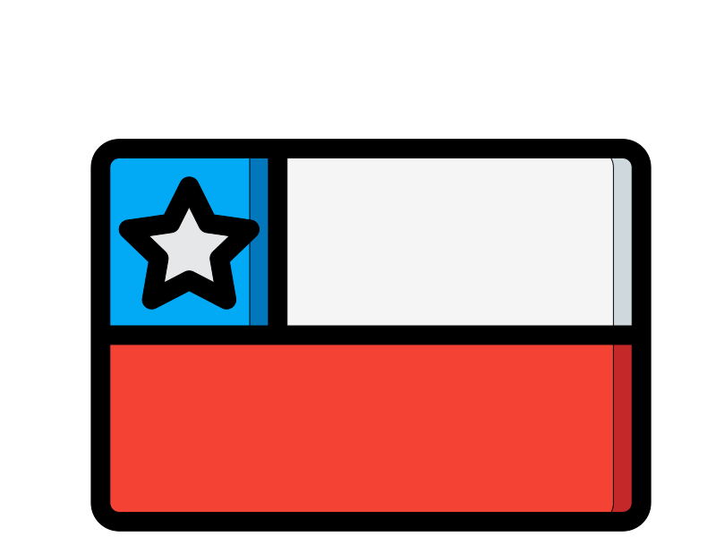

<h1>👋🏻 Hi everyone! </h1>

I'm Fernando Joost. I'm Computer Science Engineer and Full Stack Developer from  <b>Coyhaique, Patagonia, Chile.</b>  

<h3>Technologies that I used to built Backend 🦾</h3>

  
  
  
  
  

<h3>Technologies that I used to built Frontend 🎨</h3>

  
  
  

<h3>Favorite language to write code 👨🏻‍💻 </h3>

  

<h3>Follow me now!</h3>

   
   

