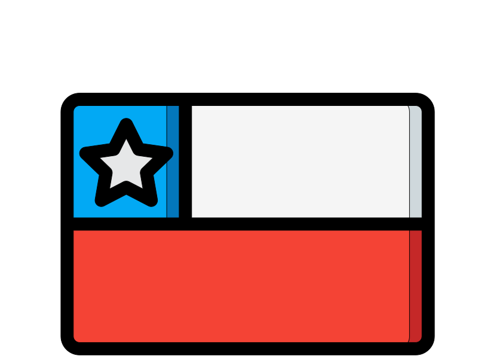

<h1>👋🏻 Hi everyone! </h1>

I'm Fernando Joost — Computer Science Engineer and Backend Developer based in <b>Santiago, Chile</b> . I design and build scalable backend systems, RESTful APIs, and service-oriented architectures with a strong focus on clean code, testing, and reliability.

<h3>Backend Stack 🦾</h3>

  
  
  
  
  
  
  

<h3>Frontend Knowledge 🎨</h3>

  
  
  

<h3>Favorite Language 👨🏻‍💻</h3>

  

<h3>Currently Focused On 🚀</h3>

  
  
  

<h3>Let's connect!</h3>

  
  

